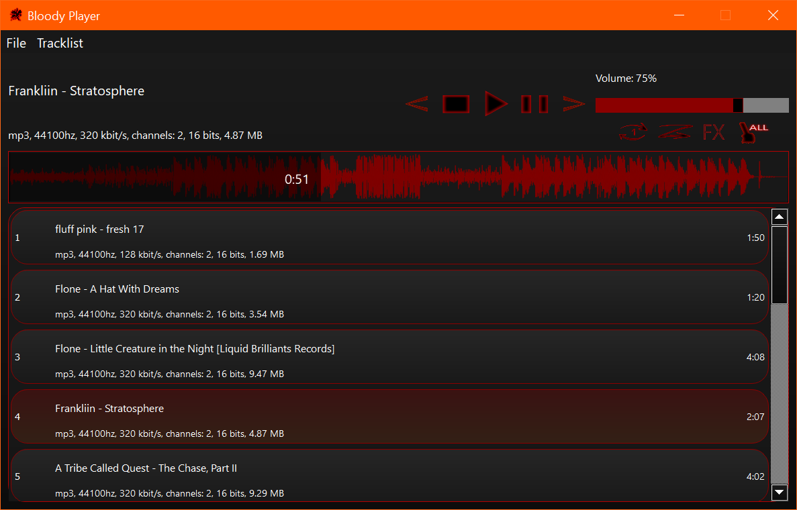

# Bloody Player
Bloody Player is an audio player created using Qt and FMOD. 

  

Features: 
- <b>Drag'n'Drop</b>. Drag'n'Drop tracks right to the Bloody Player window to add tracks to the tracklist. You can also drag'n'drop folders to add tracks from it. 
- <b>Tracklists</b>. Save the current tracklist and open it later. 
- <b>SFX</b>. Add sound effects or load your VST plugin. 
- <b>Oscillogram</b>. Click on the horizontal oscillogram displaying amplitude from time to change the current track's position. 
- <b>Repeat section</b>. Click the right mouse button on the oscillogram to set the left bound for the repetition, click the right mouse button again to set the right bound and make a repetition section in which music will repeat. 
- <b>Tracklist management</b>. Move tracks in the tracklist or delete some of them by right-clicking on the track or using hotkeys. 
- <b>Search</b>. Use Ctrl + F to open the search window to search for the desired track in the tracklist. 
- <b>"Repeat Track" / "Random Track"</b>. Use buttons under the volume slider to set "Repeat Track" / "Random Track" functions. 

# Build
1. Install FMOD from www.fmod.com/download (FMOD Engine, should include the FMOD Studio API and FMOD Core API).
2. Copy everything from api/core/lib/x86_x64/ to /usr/local/lib.
3. Build .pro file in the 'ide' folder using Qt.