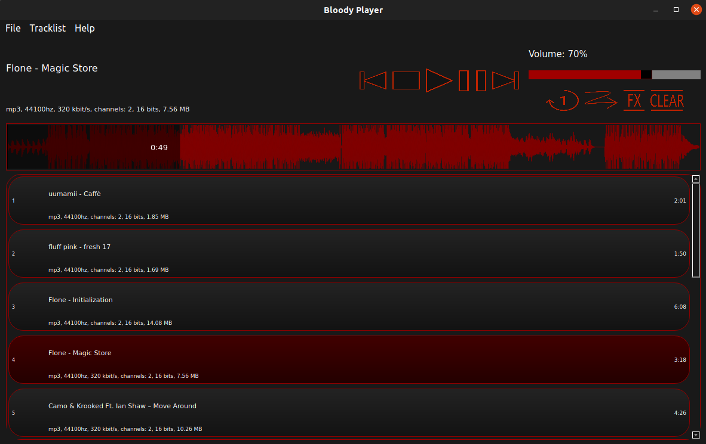

# Bloody Player
Bloody Player is an audio player created using Qt and FMOD. 

  

Features: 
- Dark-red design. 
- Drag'n'Drop. Drag'n'Drop tracks right to the Bloody Player window to add tracks to the tracklist. You can also drag'n'drop folders to add tracks from it. 
- Tracklists. Save the current tracklist and open it later. 
- SFX. Add sound effects or load your VST plugin. 
- Tracklist management. Move tracks in the tracklist or delete some of them by right-clicking on the track or using hotkeys. 
- Oscillogram. Click on the horizontal oscillogram displaying amplitude from time to change the current track's position. 
- "Repeat Track" / "Random Track". Use buttons under the volume slider to set "Repeat Track" / "Random Track" functions. 
